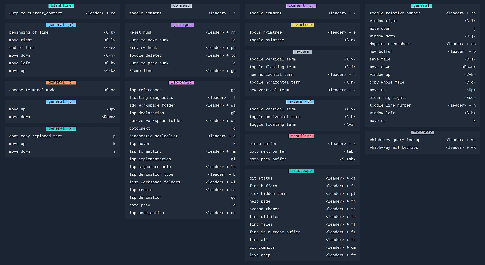

# neovim-nvchad-rust-analyzer


```
Open nvim

:MasonInstallAll
```

# LazyVim Keymaps

[http://www.lazyvim.org/keymaps](http://www.lazyvim.org/keymaps)

# NvChad Cheat Sheet



source: [https://www.reddit.com/r/neovim/comments/12qku4w/nvchad_cheatsheet/
](https://www.reddit.com/r/neovim/comments/12qku4w/nvchad_cheatsheet/
)

# References

[Neovim Kickstart](https://github.com/nvim-lua/kickstart.nvim/tree/master)

https://nvchad.com/docs/config/lsp

https://github.com/neovim/nvim-lspconfig

[The perfect Neovim setup for Rust.](https://www.youtube.com/watch?v=mh_EJhH49Ms)

[Turn VIM into a full featured IDE with only one command](https://www.youtube.com/watch?v=Mtgo-nP_r8Y)

